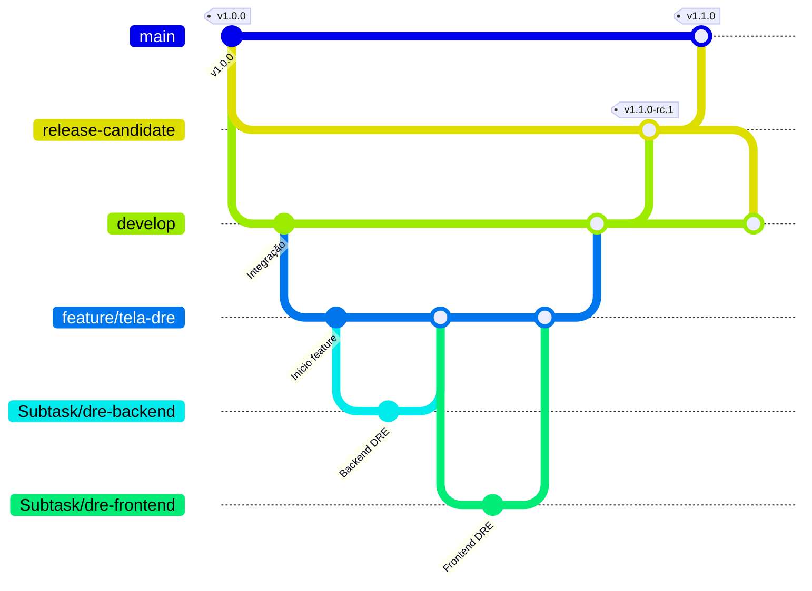

# Modelo de Ramificação

## Histórico de Versões

| Versão | Data | Descrição | Autor |
| :---: | :---: | :--- | :--- |
| 1.0 | 02/06/2026 | Criação do documento | Amanda Gois |
| 1.1 | 09/06/2026 | Corrige nome da branch release para release-candidate | Amanda Gois |
| 1.2 | 09/06/2026 | Remove feature e hotfix; atualiza branches para estrutura real do projeto | Amanda Gois |

## Histórico de Revisões

| Versão | Data | Revisor | Observação |
| :---: | :---: | :--- | :--- |
| 1.1 | 09/06/2026 | Vinicius Carneiro | Aprovado |

---

## Introdução

O modelo de ramificação utilizado no projeto COIN'S é o **GitFlow**. Este modelo organiza o desenvolvimento em torno de duas branches principais com ciclos de vida infinitos e várias branches de suporte para facilitar o desenvolvimento paralelo e a entrega contínua.

---

## Diagrama

---

## Branches Principais

### main

- **Propósito**: Código de produção estável. Todo merge aqui dispara automaticamente o workflow de Release, gerando um instalador `.exe` com tag estável (ex: `v1.1.0`) marcado como *Latest*.
- **Processo**: Recebe merges apenas da `release-candidate` após validação completa de todos os testes (Jest + Playwright) pelo QA. Nunca desenvolver diretamente nesta branch.

### release-candidate

- **Propósito**: Branch fixa de homologação. Recebe o código da `develop` quando as funcionalidades da sprint estão prontas para validação. Todo merge aqui gera automaticamente um executável de pré-release com tag RC (ex: `v1.1.0-rc.1`) para o QA testar.
- **Processo**: Após aprovação em todos os testes, é mergeada na `main` para gerar o executável oficial de produção.

---

## Branches de Desenvolvimento

### develop

- **Propósito**: Integração contínua entre frontend e backend. Branch principal de trabalho da equipe.
- **Processo**: Recebe merges das branches `feature/` concluídas via Pull Request. Quando as funcionalidades da sprint estão integradas e validadas, é mergeada na `release-candidate`.

### feature/

- **Propósito**: Desenvolvimento de uma nova funcionalidade ou tela completa do sistema.
- **Processo**: Criada a partir de `develop`. Recebe merges das `Subtask/` que a compõem. Após concluída e revisada via Pull Request, é mergeada de volta na `develop`.
- **Nomenclatura**: `feature/nome-da-funcionalidade` (ex: `feature/tela-dre`).

### Subtask/

- **Propósito**: Tarefas individuais dentro de uma feature. Usada quando uma tela ou funcionalidade é dividida entre múltiplos desenvolvedores — por exemplo, frontend e backend da mesma tela em paralelo.
- **Processo**: Criada a partir de `feature/`. Após concluída e revisada via Pull Request, é mergeada de volta na `feature/` correspondente.
- **Nomenclatura**: `Subtask/nome-da-tarefa` (ex: `Subtask/dre-filtros-backend`).

---

> **Nota**: Todo merge para `feature/`, `develop` e `release-candidate` deve ser realizado via **Pull Request** com revisão por pares.
