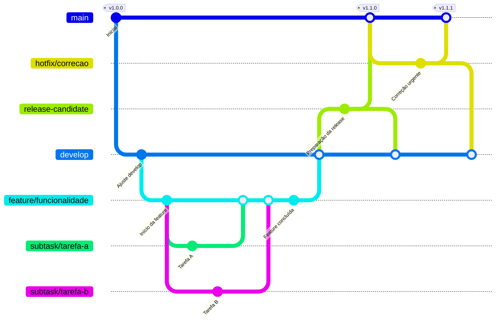

# Modelo de Ramificação

## Histórico de Versões

| Versão | Data | Descrição | Autor |
| :---: | :---: | :--- | :--- |
| 1.0 | 02/06/2026 | Criação do documento | Amanda Caroline de Gois Balcaçar |

## Histórico de Revisões

| Versão | Data | Revisor | Observação |
| :---: | :---: | :--- | :--- |

---

## Introdução

O modelo de ramificação utilizado no projeto COIN'S é o **GitFlow**. Este modelo organiza o desenvolvimento em torno de duas branches principais com ciclos de vida infinitos e várias branches de suporte para facilitar o desenvolvimento paralelo e a entrega contínua.

---

## Diagrama

---

## Branches Principais

### 1. main

- **Propósito**: Contém o código de produção, sempre estável e pronto para a versão final.
- **Processo**: Recebe _merges_ apenas de branches de `release` ou, em emergências, de `hotfix`. Nunca se deve desenvolver ou commitar diretamente nesta branch.

### 2. develop

- **Propósito**: Integração de todas as funcionalidades prontas para o próximo ciclo de entrega. É a branch principal de trabalho da equipe.
- **Processo**: Recebe _merges_ contínuos das branches de `feature` concluídas. É onde os testes integrados são realizados.

---

## Branches de Suporte

### feature/

- **Propósito**: Desenvolvimento isolado de novas funcionalidades ou grandes alterações.
- **Processo**: Criada a partir da `develop`. Após concluída, testada e revisada, é integrada (via _Pull Request_) de volta na `develop`.
- **Nomenclatura**: `feature/nome-da-funcionalidade` ou `feature/ID-da-issue`.

### release-candidate

- **Propósito**: Preparação de uma nova versão para produção. Ambiente dedicado para testes finais e homologação.
- **Processo**: Criada a partir da `develop` quando as funcionalidades planejadas estão prontas. Após a validação, é mergeada na `main` (com tag de versão) e devolvida para a `develop` caso existam correções feitas durante o período de release.

### hotfix/

- **Propósito**: Correções urgentes no ambiente de produção (bugs críticos).
- **Processo**: Criada diretamente a partir da `main`. Após a correção, é integrada na `main` (nova tag) e também na `develop`.

### subtask/

- **Propósito**: Utilizada para dividir uma `feature` muito grande em partes menores ou para tarefas internas pontuais.
- **Processo**: Geralmente criada a partir de uma branch `feature` ou da `develop`. Deve ser mergeada de volta na sua branch de origem após a conclusão.

---

> **Nota**: Todo merge para as branches `develop` e `main` deve ser realizado via **Pull Request** com revisão por pares.
