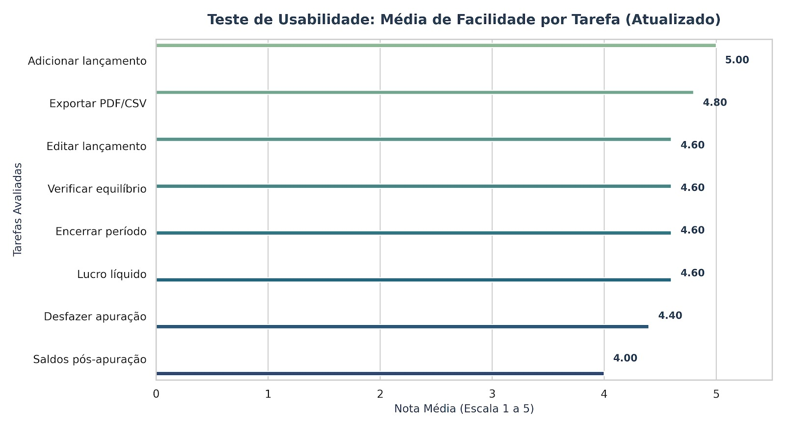

# Análise de Dados do Teste de Usabilidade

## Histórico de Versões

| Versão | Data | Descrição | Autor |
| :---: | :---: | :--- | :--- |
| 1.0 | 10/06/2026 | Criação do documento | Elise Lissa Hasegawa |

## Histórico de Revisões

| Versão | Data | Revisor | Observação |
| :---: | :---: | :--- | :--- |
| 1.0 | 10/06/2026 | Fernanda Pessoa | Aprovada |

---

## Introdução e Metodologia

Este documento apresenta a análise dos resultados obtidos no formulário de avaliação dos usuários sobre o Teste de Usabilidade do sistema **COIN'S (Contabilidade Integrada)**. A avaliação foi conduzida utilizando o método *Think Aloud* (Pensar em Voz Alta), permitindo identificar não apenas a eficiência dos usuários na execução das tarefas, mas também suas percepções subjetivas, barreiras cognitivas e níveis de satisfação.

Os participantes realizaram um conjunto de 8 tarefas críticas do fluxo contábil da plataforma. Ao final do teste, cada participante atribuiu uma nota de facilidade para cada tarefa, baseada em uma escala Likert de 1 a 5 (onde 1 representa "Muito Difícil" e 5 representa "Muito Fácil").

---

## Análise do Desempenho por Tarefa

Os dados coletados apontam para um cenário geral bastante positivo, com a maior parte das rotinas sendo classificadas entre "Fácil" e "Muito Fácil". Abaixo, as tarefas são analisadas de acordo com o seu grau de aceitabilidade e complexidade percebida.

### Pontos Fortes — Tarefas Mais Fáceis

Duas rotinas se destacaram com usabilidade impecável, atingindo a pontuação máxima ideal:

- **Adicionar um Lançamento (Média: 5,00):** A tarefa inicial e mais frequente do sistema foi considerada unanimemente muito fácil por todos os usuários. Isso indica que a interface de entrada de dados é altamente intuitiva, possui campos claros e não gera fricção no fluxo principal de alimentação do sistema.
- **Exportar em PDF ou CSV (Média: 4,80):** A rotina de fechamento e extração de relatórios foi executada com extrema fluidez. Os comandos visuais para exportação estão bem localizados e cumprem as expectativas do usuário sem ambiguidades.

Outras tarefas como **Editar um lançamento** (4,60), **Verificar o equilíbrio dos lançamentos** (4,60) e **Verificar o lucro líquido** (4,60) também demonstraram excelente desempenho, consolidando a percepção de que a navegação básica e as consultas rápidas da plataforma estão maduras.

### Oportunidades de Melhoria — Tarefas Mais Difíceis

Embora nenhuma tarefa tenha sido classificada abaixo da média neutra (nota 3), duas rotinas específicas pontuaram abaixo do restante do ecossistema e exigem atenção da equipe de produto e UX:

- **Verificar saldos das contas e o resultado após a apuração (Média: 4,00):** Esta foi considerada a tarefa mais complexa do teste. A nota 4,00 indica que, embora os participantes consigam concluir a validação, há uma carga cognitiva maior ou uma quebra de expectativa visual após o encerramento do período contábil. Os usuários demonstraram leve lentidão ou dúvida em localizar onde os saldos consolidados pós-apuração são exibidos.
- **Encerrar o período contábil / Obter o resultado do exercício (Média: 4,40):** Por se tratar de um processo crítico e de forte impacto fiscal/contábil, o fluxo de encerramento gerou um comportamento mais cauteloso. A pontuação sugere que o sistema se beneficiaria de assistentes de passo a passo (*wizards*) ou feedbacks visuais mais robustos que deem segurança ao usuário de que a ação foi concluída com sucesso.

---

## Conclusão

O sistema **COIN'S** apresenta um excelente índice de usabilidade e facilidade de uso nas suas rotinas cotidianas (como inclusão e edição de lançamentos). O fluxo contábil transita de forma lógica para o usuário. Os gargalos identificados concentram-se estritamente nos momentos de **conferência e consolidação de dados após rotinas em lote** (apuração do exercício).
