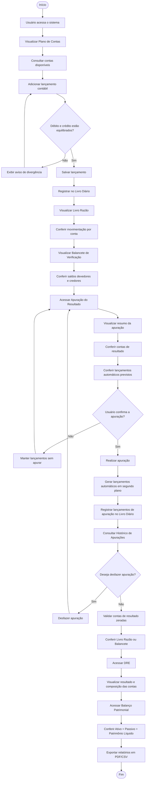

# Jornada do Usuário

## Histórico de Versões

| Versão | Data | Descrição | Autor |
| :---: | :---: | :--- | :--- |
| 1.0 | 01/06/2026 | Criação do documento | Fernanda Pessoa |

## Histórico de Revisões

| Versão | Data | Revisor | Observação |
| :---: | :---: | :--- | :--- |

---

## Introdução

Este documento descreve a jornada típica de um estudante de Ciências Contábeis ao utilizar o sistema, cobrindo desde o acesso inicial até a geração dos demonstrativos contábeis finais. O mapa de jornada serve como referência de IHC para garantir que os fluxos de interação estejam alinhados com a progressão natural das tarefas contábeis.

---

## Mapa de Jornada

O diagrama abaixo representa o fluxo principal de uso do sistema, desde o registro de lançamentos até a exportação dos relatórios:

---

## Etapas da Jornada

| Etapa | Descrição |
| :--- | :--- |
| **Plano de Contas** | Ponto de partida — o usuário consulta as contas disponíveis para identificar quais utilizar nos lançamentos. |
| **Livro Diário** | Registro dos lançamentos contábeis com validação do equilíbrio entre débito e crédito antes de salvar. |
| **Livro Razão** | Conferência da movimentação individualizada por conta após os lançamentos. |
| **Balancete de Verificação** | Confronto dos saldos devedores e credores de todas as contas como checagem intermediária. |
| **Apuração do Resultado** | Encerramento das contas de resultado com prévia completa, execução e possibilidade de desfazer. |
| **DRE** | Visualização estruturada do resultado do exercício após a apuração. |
| **Balanço Patrimonial** | Verificação do equilíbrio entre Ativo, Passivo e Patrimônio Líquido. |
| **Exportação** | Geração dos relatórios finais em PDF ou CSV. |
