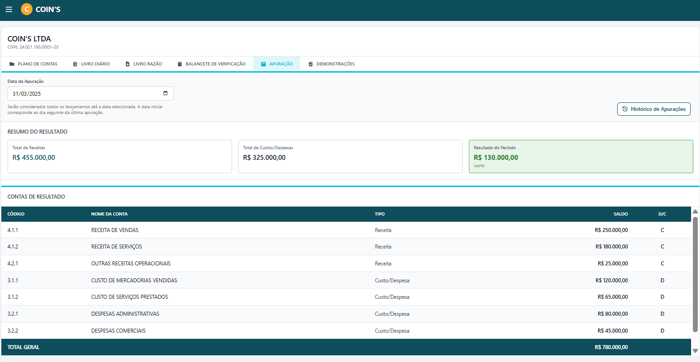
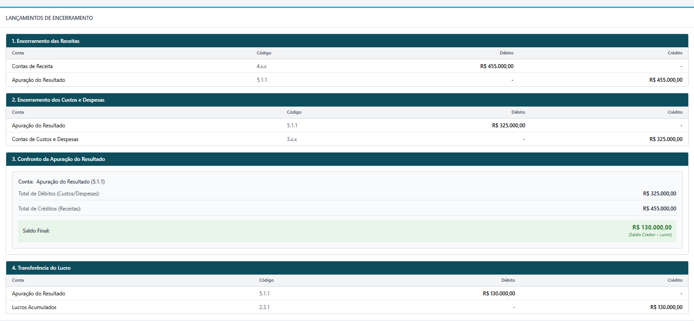
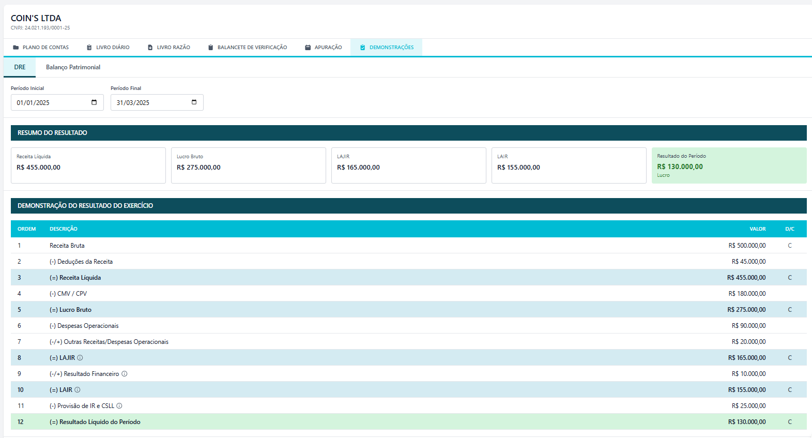

# Visão Geral de IHC

## Histórico de Versões

| Versão | Data | Descrição | Autor |
| :---: | :---: | :---: | :---: |
| 1.0 | 28/05/2026 | Versão inicial do documento | Fernanda Pessoa |
| 1.1 | 01/06/2026 | Adiciona link dos materiais de teste de usabilidade de 2025/2 | Fernanda Pessoa |
| 1.2 | 01/06/2026 | Adiciona seção de Jornada do Usuário | Fernanda Pessoa |

## Histórico de Revisões

| Versão | Data | Revisor | Observação |
| :---: | :---: | :---: | :---: |

## Sumário

1. [Introdução](#introdução)
2. [Figma Make](#figma-make)
3. [Figma](#figma)
4. [Prototipação](#prototipação)
5. [Identidade Visual](#identidade-visual)
6. [Jornada do Usuário](#jornada-do-usuário)
7. [Testes de Usabilidade](#testes-de-usabilidade)

---

## Introdução

A área de Interface Humano-Computador (IHC) do projeto abrange desde a definição da identidade visual até a validação da experiência de uso por meio de testes com usuários reais. O objetivo é garantir que o sistema seja intuitivo, acessível e coerente em todas as telas, atendendo ao perfil dos estudantes de Ciências Contábeis para quem foi projetado.

---

## Figma Make

No início do desenvolvimento das novas telas, havia uma incerteza legítima sobre quais componentes deveriam compor cada tela — quais informações exibir, como estruturar o fluxo e o que o proponente efetivamente precisaria ver. Essa dúvida era mútua: nem a equipe tinha clareza sobre o que implementar, nem o proponente conseguia especificar com precisão o que esperava encontrar.

Para superar esse impasse, o **Figma Make** foi utilizado como ferramenta de exploração e prototipação rápida. Com ele, foi possível gerar telas funcionais em pouco tempo, testando diferentes arranjos de componentes e estruturas de informação sem compromisso com a identidade visual do sistema. O resultado foi especialmente útil na tela de **Apuração do Resultado** e na **DRE**, cujos fluxos e regras de negócio eram complexos o suficiente para demandar validação visual antes de qualquer implementação.

As telas geradas no Figma Make serviram de ponto de partida para conversas objetivas com o proponente, que pôde reagir ao que via em vez de tentar descrever o que imaginava. Esse processo acelerou significativamente a compreensão das regras de negócio e permitiu alinhar expectativas antes mesmo de abrir o Figma.

Após essa etapa de descoberta, a migração para o protótipo no Figma tornou-se necessária: o Figma Make não oferece suporte à identidade visual do COIN'S — paleta de cores, componentes customizados e o padrão visual consolidado ao longo do projeto. O Figma, portanto, permanece como a fonte de verdade para decisões de interface.

---

## Figma

O projeto mantém um arquivo Figma bem estruturado, com as cores padrão do sistema, componentes reutilizáveis e fluxos navegacionais definidos. Ele serve como fonte de verdade para decisões de interface ao longo do desenvolvimento.

**Link:** [Protótipo COIN'S — Figma](https://www.figma.com/design/Z3hfLoenhr73I3u5BRU5lP/COIN-S---Contabilidade-Integrada?node-id=40000778-20259&t=jaqeTyfCvmRHlX9C-1)

---

## Prototipação

### Protótipo de baixa fidelidade

Elaborado nas fases iniciais do projeto para validar a estrutura e a navegação das telas sem compromisso com estética. Permite iterar rapidamente sobre a disposição dos elementos e os fluxos principais antes de investir no detalhamento visual.

**Link:** [Protótipo de Baixa Fidelidade — Figma](https://www.figma.com/design/Z3hfLoenhr73I3u5BRU5lP/COIN-S---Contabilidade-Integrada?node-id=29-811&t=LffhAJRG1CydnNoW-1)

### Protótipo de alta fidelidade

Desenvolvido no Figma, representa fielmente a interface final do sistema — com paleta de cores, tipografia, ícones e comportamento dos componentes. O protótipo de alta fidelidade contempla os principais fluxos do sistema, como o registro de lançamentos, a apuração do resultado e a geração de demonstrativos contábeis.

**Link:** [Protótipo de Alta Fidelidade — Figma](https://www.figma.com/design/Z3hfLoenhr73I3u5BRU5lP/COIN-S---Contabilidade-Integrada?node-id=199-2979&t=LffhAJRG1CydnNoW-1)

---

## Identidade Visual

A identidade visual do sistema está documentada separadamente e define a paleta de cores, o uso de componentes e as diretrizes de alinhamento com a identidade institucional da UFMS.

**Documento:** [Especificação de Identidade Visual](identidade-visual.md)

---

## Jornada do Usuário

O mapa de jornada documenta o fluxo principal de interação do usuário com o sistema — do acesso ao Plano de Contas até a exportação dos demonstrativos contábeis.

**Documento:** [Jornada do Usuário](jornada-usuario.md)

---

## Testes de Usabilidade

A cada semestre é conduzido um ciclo de testes de usabilidade com usuários representativos do público-alvo. Os testes seguem um roteiro estruturado e os resultados são consolidados em um relatório com achados, métricas e recomendações de melhoria.

- **[Termo de Consentimento](termo-consentimento-usabilidade.md)**
- **[Roteiro de Teste de Usabilidade](roteiro-teste-usabilidade.md)**
- **[Relatório de Teste de Usabilidade](relatorio-teste-usabilidade.md)**

### Materiais de 2025/2

Registros fotográficos (PNG), processo e relatório do ciclo de testes de usabilidade realizado em 2025/2 estão disponíveis no Google Drive:

**[Materiais de Teste de Usabilidade — 2025/2](https://drive.google.com/drive/folders/1m9vypVANcmmneq5cCtJaQjJbffQ921Tv?usp=drive_link)**
