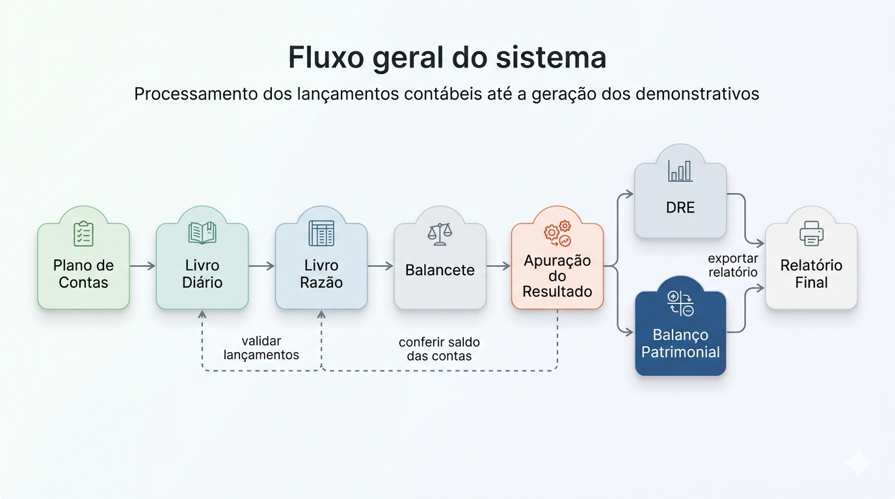

# COIN'S — Contabilidade Integrada

COIN'S é um aplicativo desktop educacional desenvolvido na UFMS pelo **Núcleo de Práticas de Engenharia de Software**, com início no segundo semestre de 2025.

O sistema foi criado para preencher uma lacuna no curso de Ciências Contábeis: os softwares contábeis profissionais só são introduzidos nos semestres avançados, deixando os alunos dos primeiros períodos sem contato prático com os processos fundamentais da profissão. O COIN'S simula um ambiente contábil real — do registro de lançamentos à geração de demonstrativos financeiros — em uma interface acessível e voltada ao aprendizado.

---

## Vídeo de apresentação

<iframe width="560" height="315" src="https://www.youtube.com/embed/u8mYq7SuCC4" title="YouTube video player" frameborder="0" allow="accelerometer; autoplay; clipboard-write; encrypted-media; gyroscope; picture-in-picture; web-share" allowfullscreen></iframe>

---

## Funcionalidades

=== "2026/1"

    | Funcionalidade | Descrição |
    |---|---|
    | **Apuração do Resultado do Exercício** | Encerramento das contas de receitas e despesas com prévia completa antes da execução. Inclui resumo do resultado, contas envolvidas, lançamentos de encerramento, transferência automática para Lucros ou Prejuízos Acumulados com compensação entre períodos, histórico de apurações realizadas e possibilidade de desfazer a última apuração. |
    | **Demonstração do Resultado do Exercício (DRE)** | Relatório estruturado com Receita Bruta, Deduções, Receita Líquida, CMV/CPV, Lucro Bruto, Despesas Operacionais, LAJIR, Resultado Financeiro, LAIR, Resultado Não Operacional e Lucro Líquido. Permite filtrar por período, expandir a composição de cada conta e possibilita a **exportação do relatório**. |
    | **Balanço Patrimonial** | Demonstrativo da posição financeira com Ativo, Passivo e Patrimônio Líquido agrupados hierarquicamente. Permite expandir e recolher grupos, exibe resumo e conferência de equilíbrio, e possibilita a **exportação do relatório**. |

=== "2025/2"

    | Funcionalidade | Descrição |
    |---|---|
    | **Plano de Contas** | Consulta ao plano de contas padrão com estrutura hierárquica de contas sintéticas e analíticas. |
    | **Livro Diário** | Gerenciamento completo de lançamentos contábeis — criação, edição, exclusão e listagem cronológica. Inclui também a opção de limpar todos os dados da empresa. |
    | **Livro Razão** | Agrupamento dos lançamentos por conta, permitindo acompanhar a movimentação individual de cada conta ao longo do período. |
    | **Balancete de Verificação** | Confronto dos saldos devedores e credores de todas as contas com filtros por período, exibição do balancete completo e resumo consolidado dos totais. |

---

## Fluxo geral do sistema

---

## Artefatos por área

A documentação reúne os principais entregáveis do projeto, organizados por área de responsabilidade:

- **[Arquitetura](arquitetura/especificacao-arquitetural.md)**: visão de alto nível, especificação arquitetural, diagramas e decisões estruturais.
- **[Requisitos](requisitos/especificacao-de-requisitos-de-software.md)**: requisitos de produto e software, regras de negócio para apuração de DRE e Balanço Patrimonial.
- **[Banco de Dados](banco-de-dados/index.md)**: modelo de dados, dicionário e documentação do modelo lógico.
- **[IHC](ihc/visao-geral.md)**: identidade visual, protótipos, Figma e testes de usabilidade.
- **[Interface e Experiência](gerencia-projeto/plano-do-projeto.md#projeto-de-interface-e-interação)**: protótipos, visão de implementação e critérios de usabilidade.
- **[Qualidade e Testes](qualidade-testes/plano-de-testes.md)**: plano de testes, critérios de aceitação e estratégias de validação.
- **[Gerência de Projeto](gerencia-projeto/plano-do-projeto.md)**: planejamento, políticas de configuração, modelo de ramificação e relatórios de progresso.
- **[DevOps](devops/visao-geral.md)**: infraestrutura proposta, fluxo de trabalho e práticas de integração contínua.
- **[Decisões](decisoes/decisoes.md)**: registro de decisões técnicas e de projeto que sustentam a solução.

---

## Stack

-   

    Framework para criação de aplicativos desktop multiplataforma com tecnologias web.

-   

    Framework JavaScript progressivo para construção da interface do usuário.

-   

    Superset do JavaScript com tipagem estática, garantindo maior segurança e manutenibilidade do código.

-   

    Biblioteca de componentes de interface baseada no Material Design para Vue 3.

-   

    Framework minimalista para Node.js, utilizado na camada de API interna da aplicação.

-   

    Banco de dados relacional embarcado, sem necessidade de servidor externo.

-   

    Query builder SQL para Node.js, facilitando migrações e consultas ao banco de dados.

---

## Download

As versões executáveis estão disponíveis na página de [Releases do repositório](https://github.com/NES-Contabilidade-Integrada/coins2026.1/releases/latest) para quem possui acesso ao repositório.

!!! info "Sistema operacional"
    O executável é voltado para **Windows 10 e 11**, conforme definido nos [requisitos não funcionais](requisitos/especificacao-de-requisitos-de-software.md).

---

## Ambientes Compartilhados

| Ferramenta | Link |
|------------|------|
| 🎨 Figma | [Protótipo COIN'S](https://www.figma.com/design/Z3hfLoenhr73I3u5BRU5lP/COIN-S---Contabilidade-Integrada?node-id=40000778-20259&t=jaqeTyfCvmRHlX9C-1) |
| 📁 Google Drive | [Pasta do Projeto](https://drive.google.com/drive/folders/1dSzfMOYWT6Y_vLQtLixwUQxB1kRvvvQ1) |
| 📋 GitHub Projects | [Board do Projeto](https://github.com/orgs/NES-Contabilidade-Integrada/projects/9/views/1) |
| 🗺️ Miro | — |
| 📓 NotebookLM | — |

---

## Disciplinas abrangidas

O sistema abrange conteúdos de diversas disciplinas do curso de **Ciências Contábeis da ESAN/UFMS**:

- Contabilidade I
- Contabilidade II
- Contabilidade III
- Contabilidade de Custos
- Análise de Custos
- Contabilidade Societária I
- Contabilidade Societária II
- Contabilidade Aplicada ao Setor Público
- Contabilidade Tributária
- Contabilidade do Terceiro Setor e Sustentabilidade
- Contabilidade Tributária Empresarial
- Contabilidade Aplicada ao Agronegócio
- Contabilidade Avançada
- Auditoria Contábil
- Análise de Demonstrações Contábeis
- Laboratório de Prática Contábil I
- Laboratório de Prática Contábil II

---

## Equipe

=== "2026/1"

    Este sistema foi desenvolvido pela seguinte equipe:

    | Nome | E-mail |
    |------|--------|
    | Amanda Gois de Balcaçar | amandagois@gmail.com |
    | Eduardo Henrique Alves | eduardohhalves@gmail.com |
    | Elise Lissa Hasegawa | eliselissa05@gmail.com |
    | Fernanda de Paula Pessoa | fernaandapessoa@outlook.com |
    | Lohan Toledo Tosta | lohan.ltt@gmail.com |
    | Vinicius Carneiro de Aguiar | viniciuscarneiro60@gmail.com |

    **Orientação:** Professora Vanessa Borges  
    **Proposto por:** Robert Armando Espejo e Jean Pleutim  
    **Técnico:** Loester Kiyoshi Teruya

=== "2025/2"

    Este sistema foi desenvolvido pela seguinte equipe:

    | Nome | E-mail |
    |------|--------|
    | Fernanda de Paula Pessoa | fernaandapessoa@outlook.com |
    | Gustavo Pinheiro Fujinohara | gustavoh.fujinoharah@gmail.com |
    | Jerfferson Jorge Felizardo Júnior | jerffersonjorgefj@gmail.com |
    | Pedro Nicoletti Sotoma | pedrosotoma@gmail.com |
    | Wagner Rodrigues Silva | engsoftwagner242@gmail.com |

    **Orientação:** Professora Maria Istela Cagnin Machado  
    **Proposto por:** Robert Armando Espejo e Jean Pleutim  
    **Técnico:** Lucas Borth

    [:material-download: Certificado de Registro do Software](assets/certificado-registro-software-2025-2.pdf)

